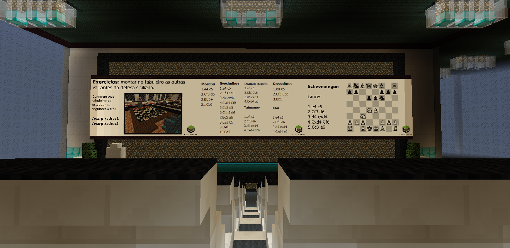
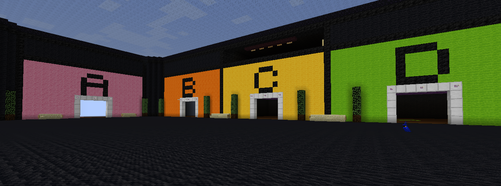
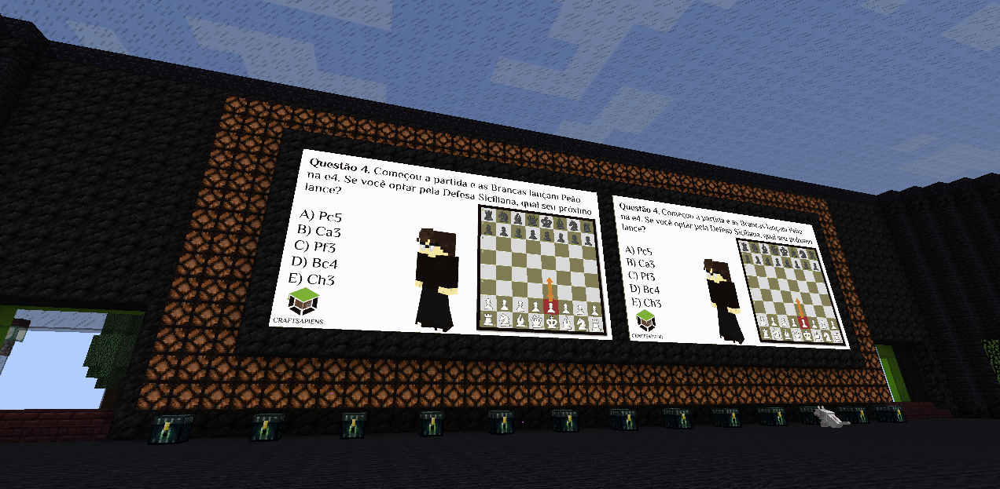

# 📔 Como participar das aulas?

As aulas gratuitas ocorrem todos os dias úteis ás 18h:30 (horário de Brasilia), o servidor também possuí aulas Premium às 19h:30.


Premium é uma das assinaturas disponíveis no servidor, que dá diversas vantagens, sendo uma delas, as aulas exclusivas. [Saiba mais](https://craftsapiens.lojasquare.net/itens)


Nesse horário, você deve entrar no servidor, usar o comando `/server Craftsapiens` no chat _(para abrir o chat pressione T)_ e após isso você estará na sala de aula, se por algum motivo não estiver na sala de aula, use o comando `/warp aula`.

Após isso, existirão várias cadeiras, e você poderá se sentar em uma cadeira livre clicando na mesma.


Evite ficar de pé ou fora da cadeira durante a aula, já que isso pode afetar a visibilidade de outros jogadores.


E pronto, agora você já consegue ver os slides da aula.

<figure><figcaption>
A sala de aula
</figcaption></figure>

Para escutar a aula, [entre no nosso discord](https://discord.gg/RRz9Z9HGnR), e entre na call [Aula Gratuita Podcast](https://discord.com/channels/892472046729179136/939947056829702204), com isso, você já conseguirá ouvir a voz do professor.

Em um momento da aula, no final, existe o evento quiz,o professor irá chamar/teleportar você para a /warp quiz, e após estar lá, aparecerão uma série de perguntas no quadro, o objetivo é testar o seu conhecimento, e como recompensa você recebe Sapiens por cada pergunta que acertar.

Ok, mas , como eu escolho a opção correta?

Então.. Após aparecer a pergunta no quadro, haverão 5 alíneas para escolher, só uma delas está certa, do seu lado, poderá ver várias salas, você vai entrar na sala que acha que tem a resposta correta, e ficar lá até o professor entregar os Sapiens e passar á proxima pergunta.

<figure><figcaption>
A /warp quiz (a letra E não apareceu na print)
</figcaption></figure>

<figure><figcaption>
O quadro da /warp quiz, onde aparecem as perguntas.
</figcaption></figure>

Após a aula acabar você poderá ver a quantidade de sapiens que ganhou usando `/money` e depositar eles no sistema Sync _(use caso queira usar os Sapiens no survival geopolitico)_ usando `/sync depositar quantidade`.

E pronto! É assim que funcionam as aulas na CraftSapiens!
