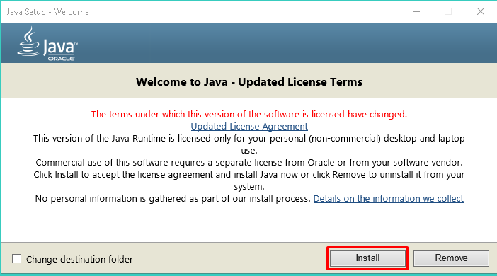
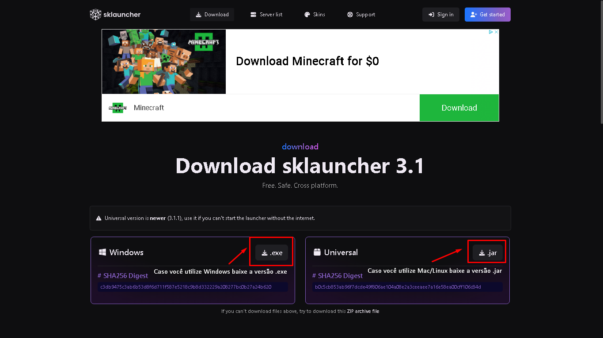
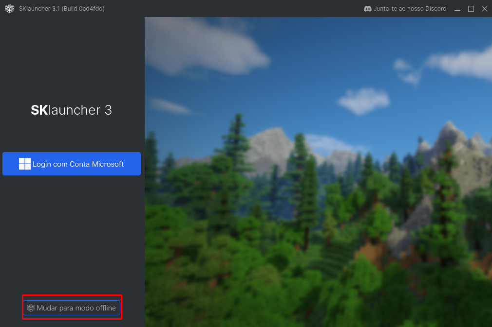
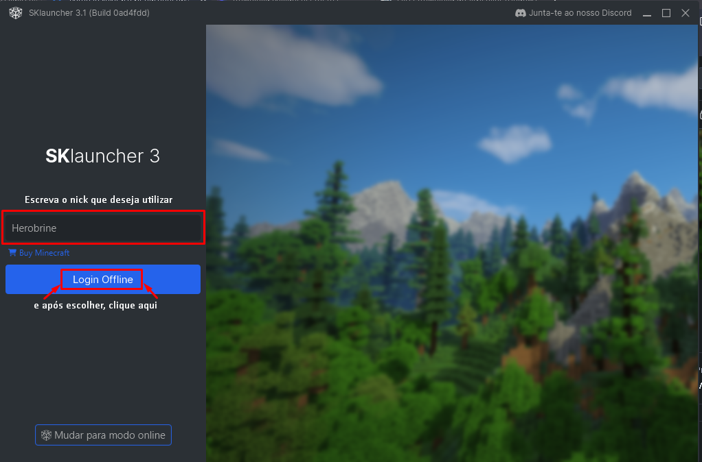
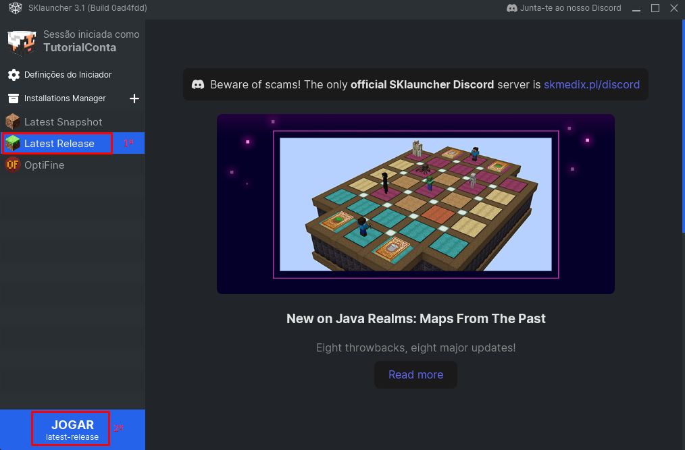

# 🙂 Como instalar e usar SKLauncher para entrar na CraftSapiens.


A instalação e configuração do SKLauncher pode ser um pouco díficil, o TLauncher é mais simples e fácil de instalar.


[Baixe o Java ](https://javadl.oracle.com/webapps/download/AutoDL?BundleId=248737\_8c876547113c4e4aab3c868e9e0ec572)[8 (obrigatório)](https://javadl.oracle.com/webapps/download/AutoDL?BundleId=248737\_8c876547113c4e4aab3c868e9e0ec572)

[Baixe o Java 17 (obrigatório para 1.17+)](https://download.oracle.com/java/17/archive/jdk-17.0.8\_windows-x64\_bin.exe)

Depois de baixar o java, execute o arquivo como Administrador, e você deverá ir dar na seguinte janela, vá marcando next , até a instalação terminar.

<figure><figcaption>
Clique no botão Install 
</figcaption></figure>

Agora que já instalou o Java 8, execute o arquivo do Java 17, e instale (só clicar sempre no botão Next e depois em Close no fim ). Depois de baixar ambos, vamos baixar e instalar o SKLauncher.

[Baixe o SKLauncher](https://skmedix.pl/downloads)

<figure><figcaption>
Caso você use a versão Windows baixe a versão .exe, caso contrário, use a versão .jar.
</figcaption></figure>

Depois de instalar , e rodar o arquivo, você deverá ir dar em essa tela

<figure><figcaption>
Clique em mudar para o modo offline.
</figcaption></figure>

<figure><figcaption>
Escolha o nick que deseja utilizar na sua conta e clique em Login Offline
</figcaption></figure>

Após fazer isso , você será redirecionado para uma tela semelhante a essa:

<figure><figcaption>
Clique em Latest release para utilizar a versão mais recente, e depois em jogar (eu já tinha o Optifine)
</figcaption></figure>


É recomendada _(opcional)_ a instalação e uso de [Optifine](https://www.youtube.com/watch?v=ikUqejsPxK8) ou [Sodium](https://www.youtube.com/watch?v=V8Ku0dDjw\_4), já que otimiza muito o seu Minecraft.



Caso o seu PC não rode a versão mais recente, clique em "`+"`_`(`ao lado de Installations Manager`)`_e escolha uma versão mais antiga _(acima da 1.16)_.


[Veja agora como entrar no servidor](./)

