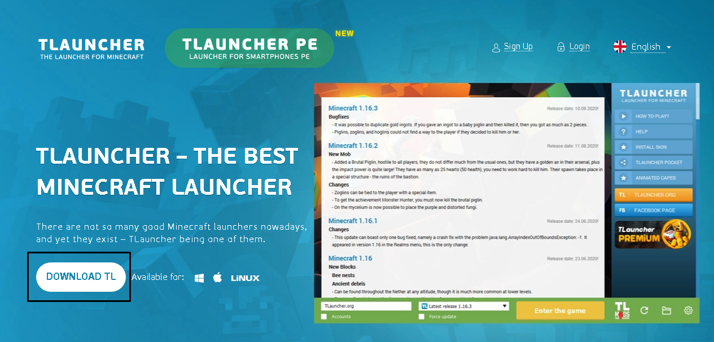
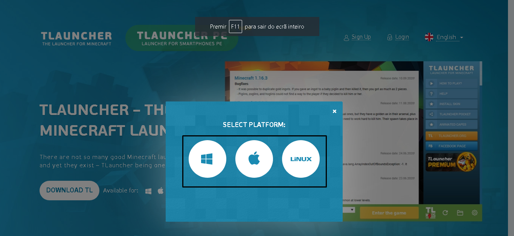
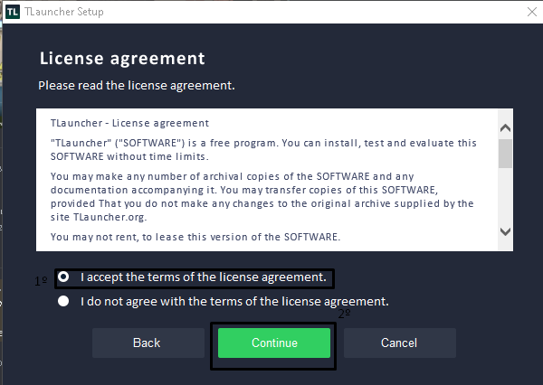
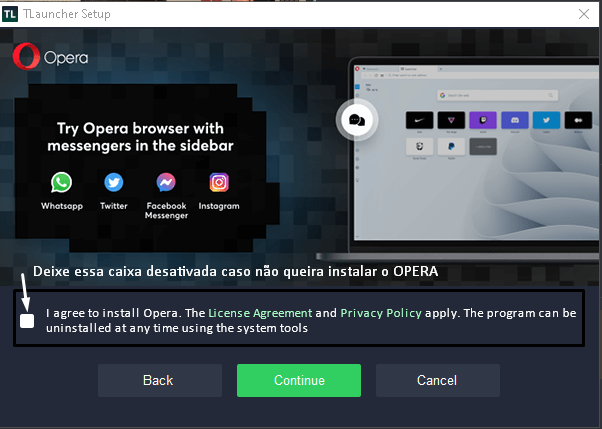
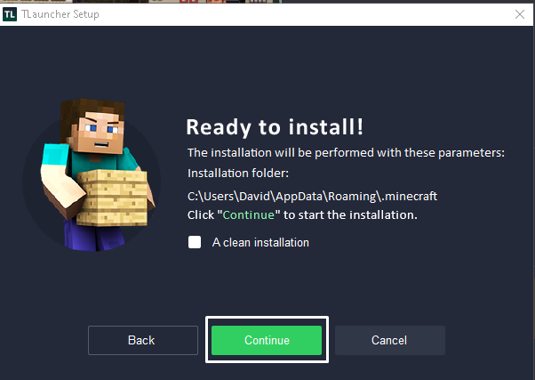
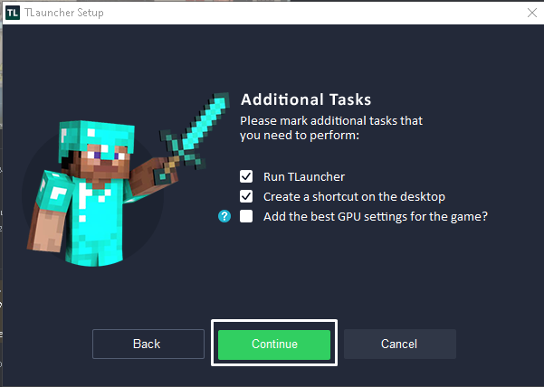
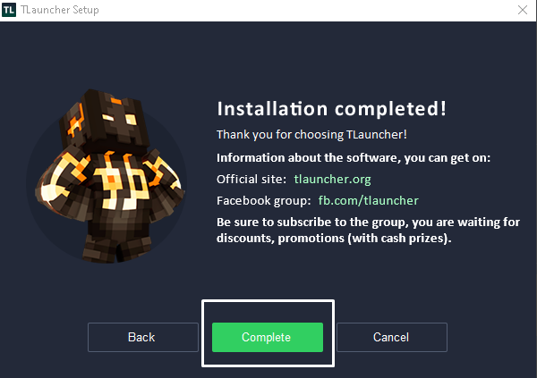
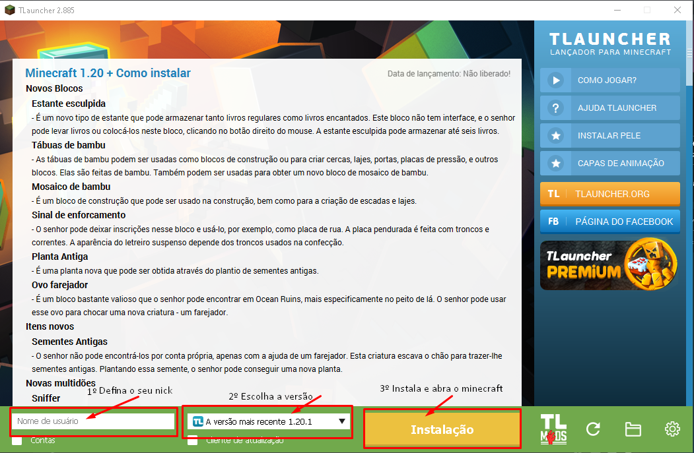

# 🙂 Como instalar e usar Tlauncher para entrar na Craftsapiens.


A instalação e configuração do Tlauncher é fácil de fazer e recomendado para iniciantes


Em primeiro lugar , baixe o Tlauncher [aqui](https://tlauncher.org/en/)

<figure><figcaption>
<strong>Clique em Download TL</strong>
</figcaption></figure>

<figure><figcaption>
<strong>Selecione o botão de acordo com o seu OS (Windows é o primeiro botão, a janela)</strong>
</figcaption></figure>

<figure><figcaption>
Clique em Continue
</figcaption></figure>

<figure><figcaption>
Aceite os termos e clique em continue.
</figcaption></figure>

<figure><figcaption>
Desmarque a caixa e clique em CONTINUE.
</figcaption></figure>

<figure><figcaption>
Clique em continue
</figcaption></figure>

<figure><figcaption>
Clique em continue de novo, após isso ele vai instalar.
</figcaption></figure>

<figure><figcaption>
E pronto! Instalação concluida, clique em complete, e o launcher já deve iniciar
</figcaption></figure>

<figure><figcaption>
Após clicar no botão instalação , aguarde um momento para instalar, e depois clique nesse botão de novo.
</figcaption></figure>

E pronto, o seu minecraft já deverá abrir normalmente!

[Veja agora como entrar no servidor!](./)
