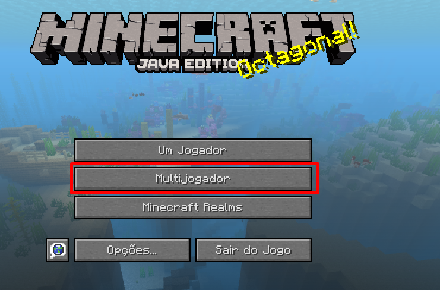
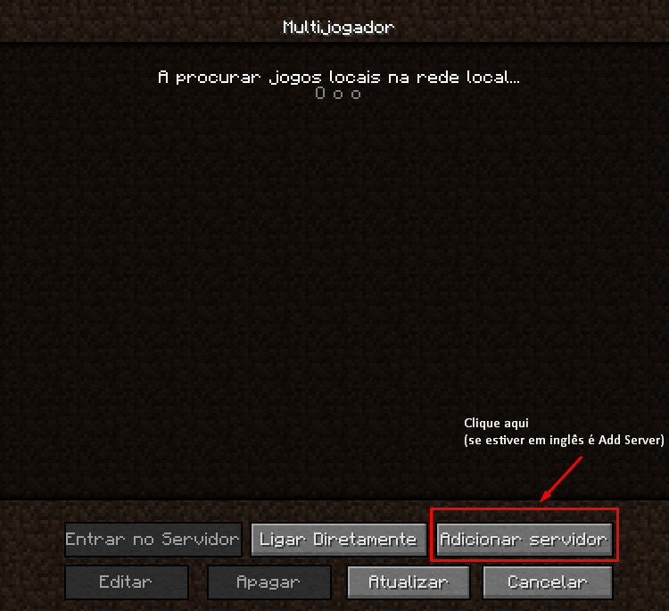
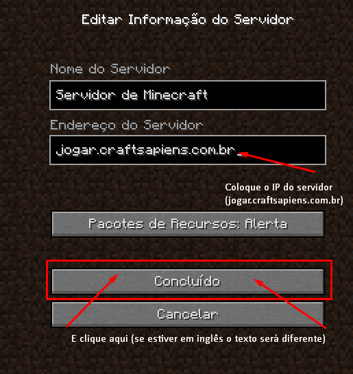
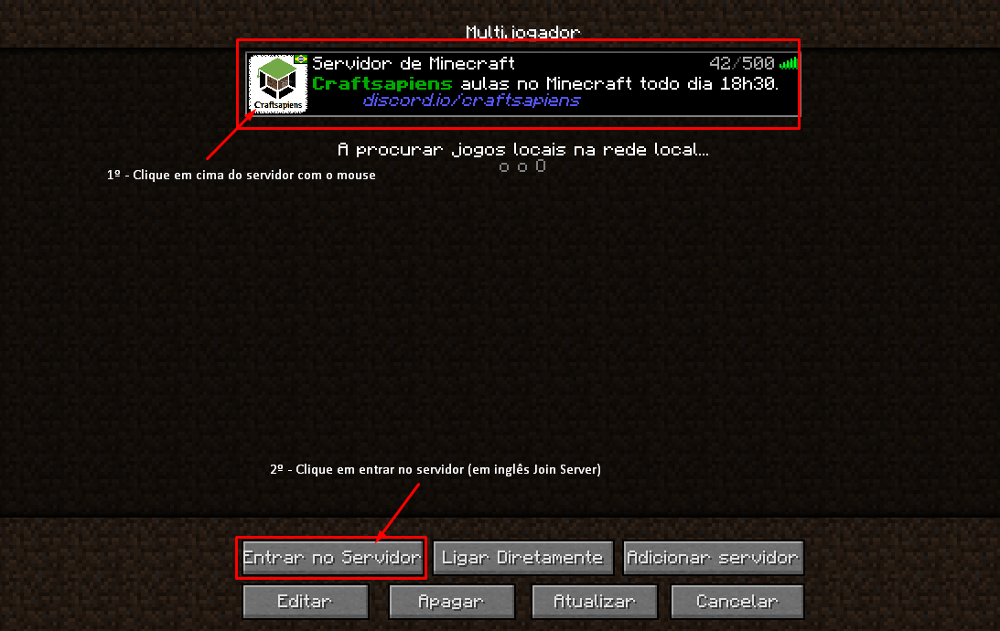
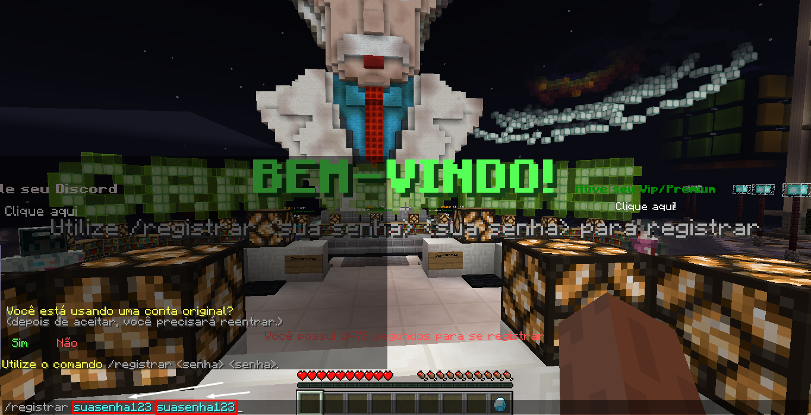

# 🙌 Como posso entrar no Servidor?

Atualmente é possível entrar na Craftsapiens em qualquer plataforma que suporte Minecraft (PC, Celular, PS4, XBOX). O tutorial abaixo é para quem vai usar o Minecraft pelo PC, para entrar com PS4 ou XBOX [veja esse video,](https://www.youtube.com/watch?v=WEorhd02P4s) caso você só possa jogar pelo Celular, [clique aqui.](setup-bedrock.md)

Em primeiro lugar, você vai precisar de possuir o Minecraft instalado _(não precisa de possuir uma conta original)_

Caso você não tenha condições de comprar minecraft, saiba como instalar o minecraft:

\--> [Usando Tlauncher](setup-tlauncher.md)&#x20;

\--> [Usando SKLauncher](setup-sklauncher.md)

**Como entrar na Craftsapiens pelo Minecraft JAVA?**

Após ter o Minecraft instalado e aberto, siga os seguintes passos:

<figure><figcaption>
<strong>Clique em Multijogador/Multiplayer</strong>
</figcaption></figure>

<figure><figcaption>
<strong>Clique em Adicionar Servidor (inglês = Add Server)</strong>
</figcaption></figure>

<figure><figcaption>
Coloque o endereço do servidor da Craftsapiens e clique em concluido
</figcaption></figure>

<figure><figcaption></figcaption></figure>

Após isso, você precisa de definir a sua senha, a senha deve ser segura, só você deve saber ela, é essa senha que vai proteger a sua co nta, guarde ela em um local seguro.

<figure><figcaption></figcaption></figure>

Após isso, boa, já têm minecraft instalado e já está registrado no servidor da craftsapiens.

[Saiba agora como participar das aulas](../classes.md).
