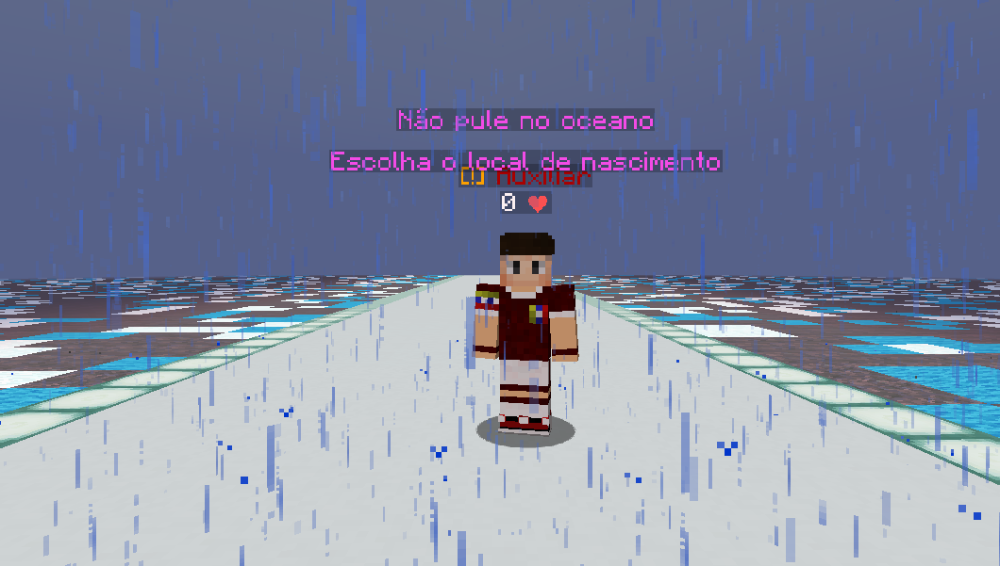

# 🤓 Como funciona o servidor Geopolítico?

Após participar das aulas e acertar perguntas no quiz, como referido no tópico anterior, você ganha Sapiens - a moeda oficial do servidor. Para sacar os seus Sapiens, que foram depositados no tópico anterior use o comando `/sync sacar`.

Enquanto não estão a acontecer aulas, você pode se divertir no servidor Geopolitico da Craftsapiens. Para entrar é muito simples , digite o comando `/server Survival` ou clique no NPC "Survival Geopolitico" que está no lobby .&#x20;

Após entrar no Survival Geopolitico, você deverá ir dar em um lugar como esse:

<figure><figcaption>
O local inicial que você nasce.
</figcaption></figure>

Essa parte pode parecer dificil, mas não é!&#x20;

Você só precisa seguir em frente até encontrar vários vidros com espaços livres entre eles, esses espaços livres são os continentes, e você vai pular em um deles, assim que você tocar em um continente, irá ser teleportado para esse lugar _(você vai começar a cair com queda lenta)._ após isso, você tem duas opções, ficar jogando na zona selvagem _(qualquer um consegue destruir)_, criar a sua cidade _(custa 5M de sapiens para quem não tem VIP)_ ou entrar em uma cidade _(recomendado para iniciantes)_ , para entrar em uma cidade você precisará perguntar a algum prefeito se está recrutando , para isso envie uma mensagem no Chat Global _(para conversar com outros jogadores no global , use `/g <mensagem`)_ , e comece por enviar algo do género `/g Alguma cidade recrutando novos jogadores?`  após isso, você deverá ter resposta de um dos prefeitos falando `Sim ,a minha está recrutando, quer entrar?.` Após encontrar um prefeito recrutando, siga as instruções dele para entrar na cidade.

Nota: O servidor geopolitico possui o plugin Slimefun, que adiciona muitas mecânicas novas como eletricidade, radiação, misseis, armaduras novas, espadas novas entre MUITOS outros, para pegar o livro dos craftings use `/sf guide`. [Veja essa aula explicando um pouco sobre o slimefun!](https://www.youtube.com/watch?v=gvyd0PjIUE4)


Ao entrar no Survival Geopolítico, é recomendado que você use o comando `/kit tutorial` , esse livro irá ensinar para você mais coisas sobre o geopolitico



Membros VIP/Premium não necessitam de 5M Sapiens para criar uma cidade, entre muitas outras vantagens como por exemplo para o premium, aulas exclusivas,poder de voar, kits, entre MUITAS outras vantagens! [Adquira o seu VIP/Premium aqui](https://craftsapiens.lojasquare.net)



O VIP/Premium não é necessário para jogar no servidor, o VIP dá vantagens extra no jogo, mas não são necessárias para jogar no servidor.

